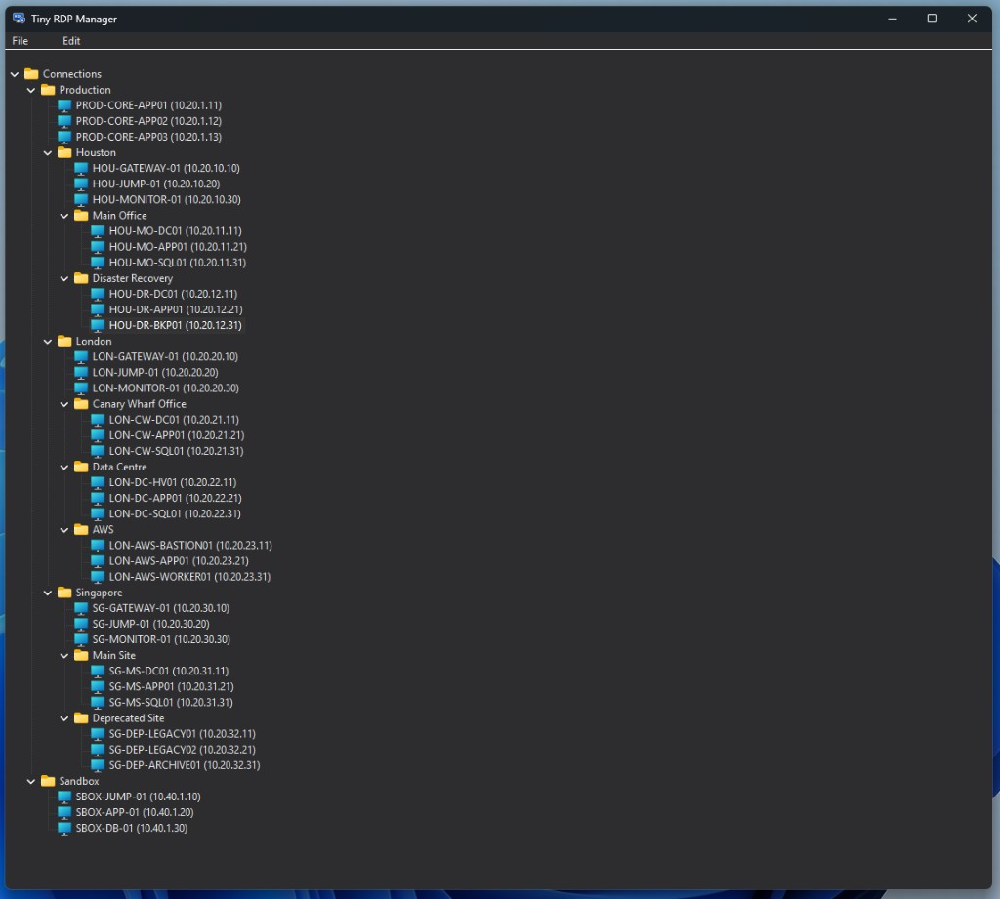

<p align="center">
  
</p>

<h1 align="center">Tiny RDP Connection Manager</h1>

<p align="center">
  Native Windows RDP session manager with folder organization,<br/>
  credential profiles, and mRemoteNG XML import/export.
</p>

<p align="center">
  <a href="LICENSE"></a>
  
  
  
</p>

## Screenshot



## Why TinyRdp

- Folder-based RDP organization with drag-and-drop, duplicate, copy, and paste.
- Credential profiles stored in Windows Credential Manager (DPAPI-backed).
- Bulk credential assignment for multi-selected sessions and folder scopes.
- mRemoteNG-compatible XML import/export for migration and interoperability.
- Lightweight native Win32 app with no heavy framework dependency.

## Features

- Tree view with folders and RDP sessions (name, host/IP, port default 3389)
- Reusable credential profiles linked to sessions
- Bulk credential assignment for multi-selected sessions and folder scopes
- Launch sessions in fullscreen via `mstsc.exe` (separate process)
- Drag-and-drop reparenting, copy/paste, duplicate
- Import and export connections in mRemoteNG XML format (folders and RDP sessions)
- Inline rename (F2 / slow double-click on label)
- Built-in changelog dialog (`File -> Changelog...`)
- Theme selection (`File -> Theme -> System/Light/Dark`)
- Menus and context menu

## Tech Stack

| Area | Stack |
|------|--------|
| Language | **C++17** (MSVC, `/W4`, static CRT in Release) |
| Build | **CMake** 3.20+, **Visual Studio 2022** (x64), Windows SDK |
| UI | **Win32** API, Common Controls, modal dialogs, `uxtheme` |
| Persistence | **JSON** via vendored [**nlohmann/json**](https://github.com/nlohmann/json) |
| Import / export | **MSXML 6** DOM for mRemoteNG-compatible XML |
| Secrets | **Windows Credential Manager** (`wincred.h`) |
| RDP launch | `mstsc.exe` + temporary `.rdp` files |
| Icon tooling | Python + Pillow (`resources/build_icon.py`) |

## Security Model

- `connections.json` and `credentials.json` under `%AppData%\TinyRdp\` hold metadata only.
- Passwords are saved in Credential Manager targets `TinyRdp/Profile/{uuid}`.
- On connect, credentials are mirrored to `TERMSRV/{host[:port]}` for `mstsc.exe`.
- No app-level encryption keys or reversible password blobs in project files.
- Clipboard transfer uses `TinyRdp/NodeV1` JSON subtree format without passwords.

## Requirements

- Windows 10 or 11 (x64)
- Visual Studio 2022 or Build Tools with Desktop C++
- CMake 3.20+

## Build

```powershell
cd c:\source\tinyrdp
cmake -B build -G "Visual Studio 17 2022" -A x64
cmake --build build --config Release
```

Output: `build\Release\TinyRdp.exe`

### Full path variant

```powershell
cd c:\source\tinyrdp
& "C:\Program Files\CMake\bin\cmake.exe" -B build -G "Visual Studio 17 2022" -A x64
& "C:\Program Files\CMake\bin\cmake.exe" --build build --config Release
```

## Usage

1. Run `TinyRdp.exe`.
2. Open `File -> Manage Credentials` to add profile username/domain/password.
3. Create folders and sessions; link a credential in the session editor.
4. Connect by double-click, pressing `Enter`, or using `Connect`.
5. Use `Set Credential...` for bulk assignment on selected sessions/folders.
6. Use `File -> Import` / `File -> Export` for mRemoteNG XML.

## Example mRemoteNG Export XML

- `examples/mremoteng-export-example.xml`

Import this file with `File -> Import...` to test your importer and use it as a template for larger exports.

## Keyboard Shortcuts

| Key | Action |
|-----|--------|
| Enter | Connect selected session |
| Delete | Delete selected item |
| Ctrl+C | Copy subtree |
| Ctrl+V | Paste subtree |
| Alt+Right-click | Range-select visible sessions |
| F5 | Refresh tree view |

## Data Locations

All persistent app data is under `%AppData%\TinyRdp\`.

| Location | What is stored |
|----------|----------------|
| `%AppData%\TinyRdp\connections.json` | Folder tree and RDP sessions metadata (no passwords) |
| `%AppData%\TinyRdp\credentials.json` | Credential profile metadata (no passwords) |
| Credential Manager `TinyRdp/Profile/{profile-uuid}` | Profile password (DPAPI-backed) |
| Credential Manager `TERMSRV/{host}` / `TERMSRV/{host:port}` | Mirrored credentials for `mstsc.exe` |
| `%TEMP%\TinyRdp\{session-id}.rdp` | Temporary launch file (no password field) |
| `%AppData%\TinyRdp\app.log` | Diagnostics log |

## Branding Assets

- App icon source: `docs/images/tinyrdp-icon.png`
- Open Graph/social preview image: `docs/images/tinyrdp-opengraph.png`
- Screenshot: `docs/images/app-screenshot.png`
- Generated Windows icon (`.ico`): `resources/app.ico`

## License

This project is licensed under the [MIT License](LICENSE).
